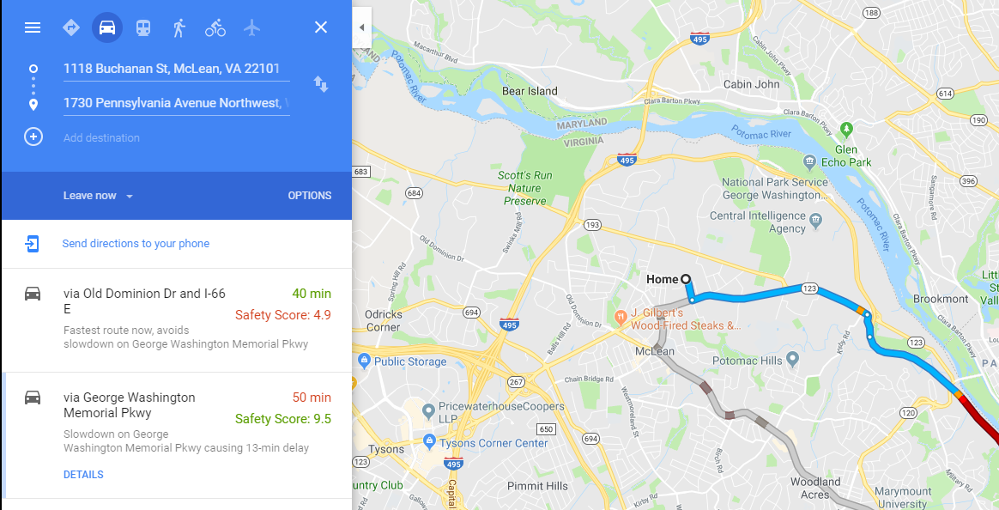
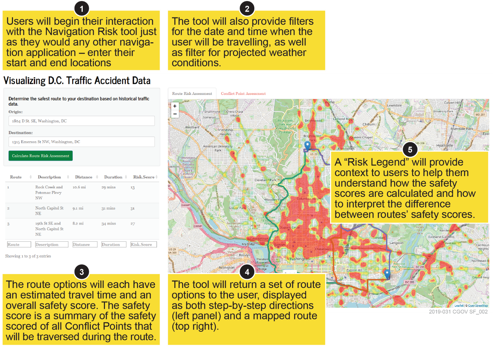
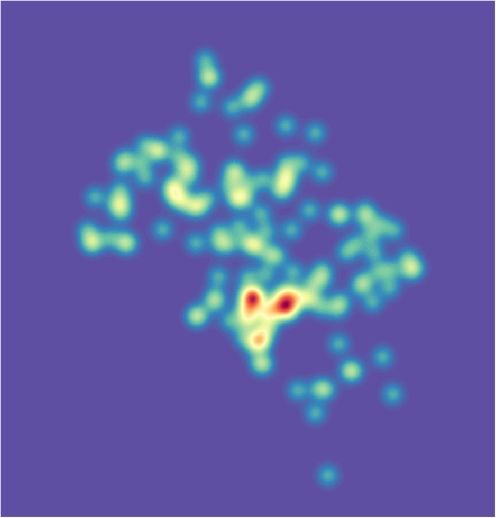

# GuideSafe AI Route Risk Solution
Imagine you just found a new job in Washington D.C., and are planning your commute for the first time. You need to travel from Northern Virginia to your new office in Northwest D.C. You are dropping your children to school on the way and care about completing the trip both quickly and safely. You fire up Google Maps and plot your route. It gives you two options, one that takes 1 hour and another that takes 1 hour and 10 minutes. Instinctually you choose the fastest route even though there is no indication on which of these routes is safest. In addition you are planning to take this trip tomorrow, when there is a chance of thunderstorms. Unknown to you the fastest route actually takes you through Dupont Circle which is a very high risk accident area. The rain hampers visibility and you end up getting into a fender bender merging into the traffic circle. You spend an extra hour dealing with the incident, but are grateful that it wasn’t something more serious. 

What if there were a way to avoid this headache by seeing which of Google’s suggested route’s was the safest?

The GuideSafe AI solution enables you to enter a start and end destination and see not only the fastest routes to your destination on a map, but also compare the relative safety of each suggested route, factoring in the safety impact of other factors such as weather and time of day. Now you know that route that was 10 minutes longer is much less risky, enabling you to not only get to your destination quickly, but keep yourself, family, and other motorists safe as well.

## Solution Overview
Commuters have a wide array of options for determining the optimal route between two points. However, there are currently no platforms available for commuters to evaluate the relative safety of their chosen route. While commuters may be able to determine multiple routes from Start to End, across one or more transit systems, they have no way to select the route that has historically been the least prone to incident – the safest route. Furthermore, we blend in new forms of data such as historical weather, to help make predictions of how these factors could also impact the safety of these routes.

[Live Demo for DC Only](https://houseguides.shinyapps.io/Solve4Safety/)

### Typical User Interaction
A user will interact with our navigation user interface (UI) just as he or she would any GPS-navigation tool. Enter start and end points and our navigation tool will produce a detailed output regarding the safety of the proposed trip. The user can also to predict risk of future travel by specifying dates and times for travel. We automatically pull in weather predictions for the intended time of travel, but the user can also simulate the effect of other weather conditions as well as some other typical factors. 
With user input of just the start and end locations our model will return the route information, as from any other navigation platform, supplemented with a detailed description of the safety of the proposed route including an overall safety score and list of “high-risk” Conflict Points along their proposed route.
We have built a working rough prototype of this solution using crash data specific to the Washington D.C area. The diagram below shows the typical user interaction through our visualization.

### Machine Learning Overview
Utilizing kernel density estimation (KDE) models, our solution uses historical crash data to generate traffic incident risk zones based on environmental variables such as time of day and weather conditions. The Google Maps API is then used to generate multiple suggested routes between a given origin and destination, based on user input. We then use a geometric processing engine to assign relative risk coefficients to each individual coordinate along the suggested paths, based on the density function output of the KDE model. When summed, the risk coefficients along the entirety of a route generate a total risk assessment score based on the given environmental factors. 
To provide users with an interactive visualization of their route risk assessments, our solution utilizes R Shiny in conjunction with Leaflet to produce powerful and intuitive dashboards. R Shiny, an open-source R Package, allows the user to provide input through a web application interface which then become parameters in the kernel density estimation models, thus impacting the relative route risk assessments. To display the suggested routes and provide the user with a visual representation of risk zones along their way, our solution utilizes Leaflet, a leading open-source JavaScript library for producing interactive maps. When used together, our solution empowers the user to better understand risks associated with different routes and while traveling under varying conditions.

Crash Kernel Density Model (KDE)

## Setup Instructions
Here are the libraries you need:
* library(shiny)
* library(shinythemes)
* library(leaflet)
* library(RColorBrewer)
* library(leaflet)
* library(maptools)
* library(leaflet.extras)
* library(rgdal)
* library(sp)
* library(RColorBrewer)
* library(readr)
* library(ks)
* library(MASS)
* library(mapsapi)
* library(dplyr)
* library(rgeos)
* library(stringr)
* library(here) 

THE BEST WAY to run the app: 
* open the RouteRisk R Project in R Studio,
* then open the run script (run.R) and select the run app button. 

